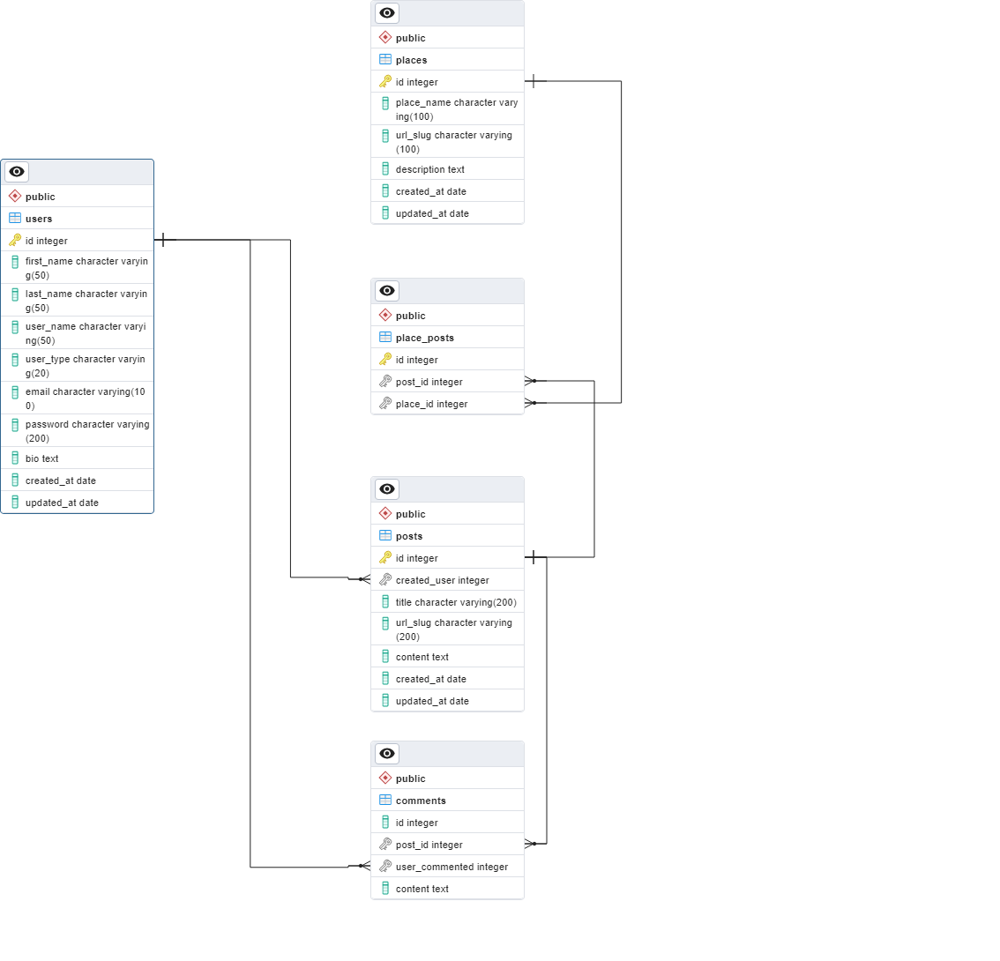

# HOW DID I BUILT THIS

- pre requesites - know a programming language, preferably javascript and its asynchronous programming concepts, sql, node and react basic concepts ( watch fireship 100 sec videos for quick start )

- create client and server folders
- git init and gitignore
- in server - npm init -y and install express
- create app.js and run a server on PORT 5000
- install pg package
- install dotenv package- its just to set environment variables from a file called .env (no need in production or if you have environment variables already set up)
- point to remember - .env file should be in same folder where we installed dotenv package otherise configure absolute of the .env file as an argument in config() method
- add code connect POSTGRES db - done, go with client
- add dev dependency nodemon
- Make db connection handle exception
- Start the server only when db is connected
- checkpoint - push the code since you have connected the DB, Yay!
- Design and create Blog database ( tables and relations )

  

- Likes is not part of v1, to be implemented in v2
- Populate sample data, create Routes
- Create routes folder
- Create CRUD Routes for POSTS
- push for April 6
